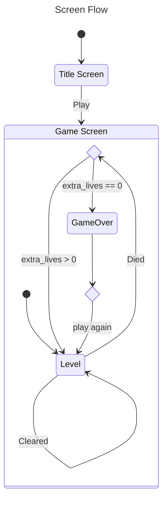

# Godot Space Invaders

## Scenes

- [ ] Title screen
- [ ] Player / laser base
- [ ] Aliens (3)
- [ ] UFO
- [ ] Bunkers
- [ ] HUD

## References

### Screenshots

- https://www.pixelatedarcade.com/games/space-invaders/screenshots

### Gameplay

- http://www.freespaceinvaders.org
- [Space Invaders 1978 - Arcade Gameplay](https://youtu.be/MU4psw3ccUI?si=fx07xLHI2ABPWQK2)

### Other

- https://en.wikipedia.org/wiki/Space_Invaders
- https://engineering.purdue.edu/OOSD/F2009/Assignments/IPA/invader.html
- https://www.computerarcheology.com/Arcade/SpaceInvaders/
- https://www.goto10retro.com/p/revisiting-space-invaders
